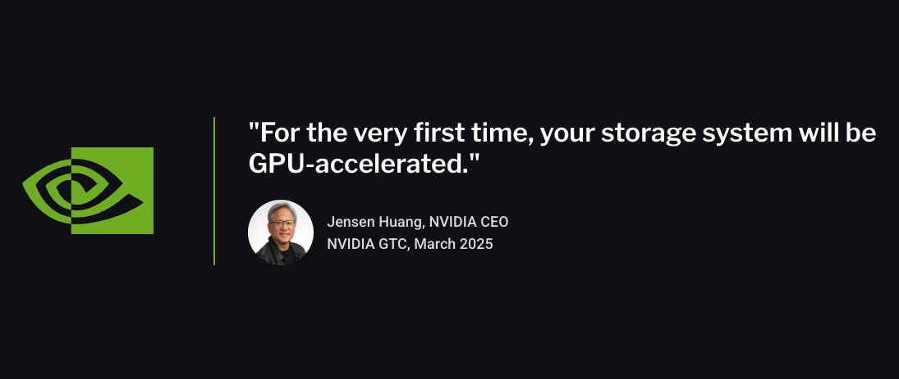
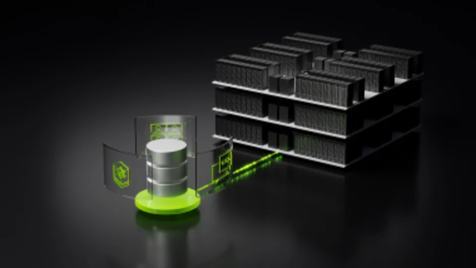

 

<a class="news-card" href="https://www.ithome.com.tw/pr/177462" target="_blank">
  
  
新聞PowerStoreDell

  
Dell PowerStore Elite

  
生成式 AI 正以驚人速度改變企業的資料使用與營運模式，而 Dell PowerStore Elite 正是專為此趨勢量身打造的「持續現代化」儲存平臺。

</a>

<a class="news-card" href="https://hk.finance.yahoo.com/news/ai%E8%B3%87%E6%96%99%E9%87%8F%E6%9A%B4%E5%A2%9E-%E8%BC%9D%E9%81%94%E6%8E%A8%E5%8B%95%E8%AE%93gpu%E7%9B%B4%E6%8E%A5%E8%AE%80%E5%8F%96%E5%84%B2%E5%AD%98%E8%A3%9D%E7%BD%AE-%E9%80%9F%E5%BA%A6%E9%80%BC%E8%BF%91%E8%A8%98%E6%86%B6%E9%AB%94-104438886.html" target="_blank">
  
  
新聞GDSNvidia

  
GPU直接讀取儲存裝置

  
AI資料量暴增 輝達推動讓GPU直接讀取儲存裝置、速度逼近記憶體。

</a>

### **官方下載**

[NVIDIA Drivers 官方下載](https://developer.nvidia.com/datacenter-driver-archive) 
[Fabric Manager 官方下載](https://developer.download.nvidia.com/compute/nvidia-driver/redist/fabricmanager/linux-x86_64/) 
[Veeam 官方下載](https://www.veeam.com/products/downloads/latest-version.html)

### **快速查詢**

[Dell Connectrix Target Code](https://www.dell.com/support/kbdoc/en-us/000228560/minimum-recommended-and-latest-code-versions-for-networking-products) 
[Dell PowerStore Target Code](https://www.dell.com/support/kbdoc/zh-tw/000175213/powerstoreos-matrix) 
[Dell Unity Target Code](https://www.dell.com/support/kbdoc/en-us/000020641/dell-emc-unity-oe-revision-matrix?lang=en)

---
!!! info "聯絡資訊"
    

            
      

      **站長工程師：Andy Hsu** &nbsp;&nbsp; **Email:** andy0583@gmail.com 
      **Certificate:** PMP、Dell、Netapp、VMware、RedHat、Veeam 
      如有任何技術問題或建議，歡迎隨時與我聯繫。 
      **請保持心中的光，因為你不知道，誰會藉著你的光走出黑暗。**
      

    

    ---
    

      
      
      
    

